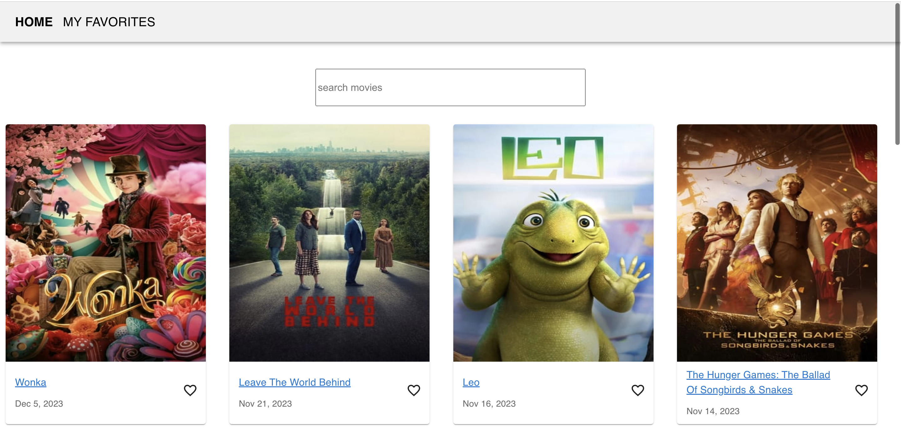
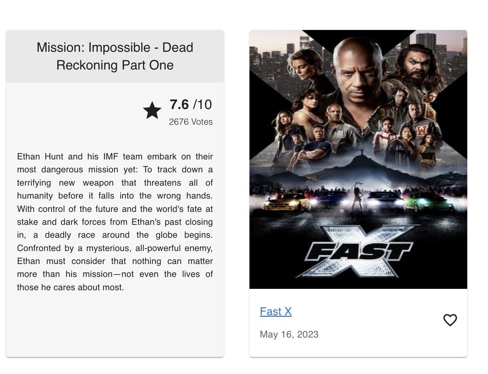

# MyFilmCompanion

MyFilmCompanion is a simple React application created using Create React App (CRA) that provides an easy way to explore and mark your favorite movies. The app fetches popular movies from The Movie Database (TMDb) API, displays them in a user-friendly interface, and allows users to mark movies as favorites.

## Table of Contents

- [Getting Started](#getting-started)
  - [Prerequisites](#prerequisites)
  - [Installation](#installation)
- [Features/Usage](#usage)
- [Screenshots](#screenshots)
- [Libraries and Dependencies](#libs)

## Getting Started

### Prerequisites

- [Node.js](https://nodejs.org/) (version 21.4.0)
- [npm](https://www.npmjs.com/) (version 10.2.4)

### Installation

1. **Clone the repository:**

   ``` 
   git clone https://github.com/apoorvak1997/my-film-companion
   ```

2. **Navigate to project directory:** 

    ```
    cd my-film-companion
    ```

3. **Install dependencies:**

    ```
    npm install 
    ```

4. **Set up API key:**

    - Obtain your TMDb API key from [The Movie Database](https://www.themoviedb.org/documentation/api).
    - Replace `your-tmdb-api-key` with your key in '.env' file :

        ```
        REACT_APP_TMDB_API_KEY=your-tmdb-api-key
        ```
5. **Run the app:**

    ```
    npm start
    ```
6. **Open your browser:**

    Open a browser of your choice and navigate to [http://localhost:3000](http://localhost:3000) to interact with MyFilmCompanion.

MyFilmCompanion is currently running on your local machine. You can browse through popular movies, see their details, and mark them/remove them from your favorites. 

### Features/Usage

1. **View Popular Movies:**
   - Your landing page will display list of popular movies sorted by release date.

2. **Fuzzy Search:**
   - You can search through the popular movies in a fuzzy format

3. **View Movie Details:**
   - Click on a movie to view more details.
   - The movie details lists overview of the movie, the vote average rating and the vote count.

4. **Navigate to 'My Favorites' section:**
   - Navigate to the 'My Favorites section in the navigation bar to view movies you marked as favorite.

5. **Add and Remove Movies from 'My Favorites':**
   - You can select(click) the 'heart' to mark a movie as your favorite
   - You can deselect(click) the 'heart' to remove a movie from your favorites list.

### Screenshots

### Landing Page - Discover Popular Movies


Home page, with search bar to search through popular movies.

### Movie Details 


Click on a movie to view movie details 

### My Favorites


Click on My Favorites in Navigation Bar to see list of movies marked as favorites.

## Libraries and Dependencies

MyFilmCompanion is built with the help of several open-source libraries and dependencies to enhance its functionality and user interface. Here are the key libraries used:

- **React:** The core JavaScript library for building the user interface.
- **Create React App (CRA):** A toolset for quickly setting up React applications.
- **Material-UI:** A popular React UI framework that provides a set of high-quality React components implementing Google's Material Design.
- **React Router:** Used for navigation within the MyFilmCompanion application.

